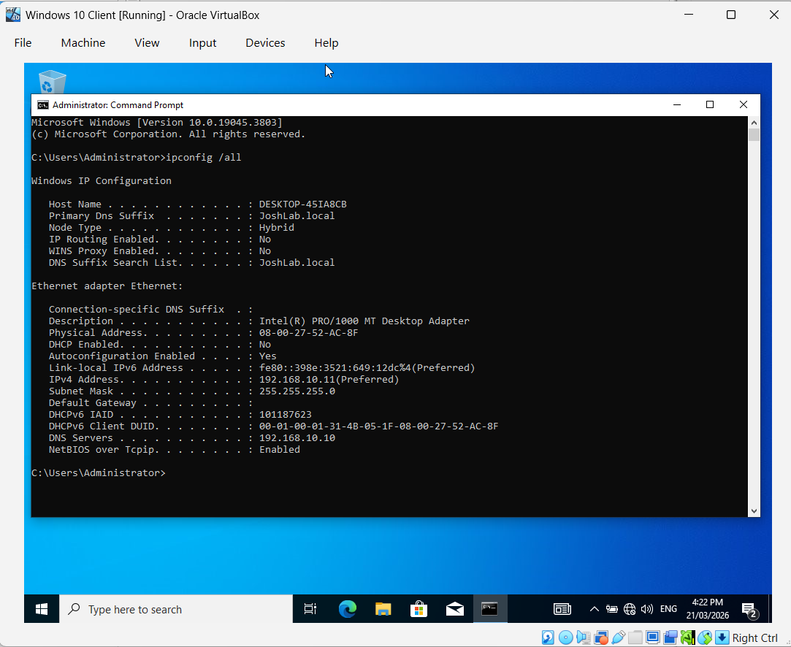

# Help Desk Lab – AD & Domain Setup

## Lab Setup: VirtualBox Client and Server
### Environment:
- Windows Server 2022 (Domain Controller)
- Windows 10 Client
- Active Directory Domain Services (AD DS)
- Virtualisation software (VirtualBox)
- Server and client VMs configured on the same internal network.

## Active Directory
- Set up an Active Directory domain
- Configured client IP and DNS settings to ensure connectivity

- Tested connectivity using ipconfig /all

- Created Organizational Units

## Security Groups & Network Shares
- Created security groups in AD to manage access to department-specific network shares  
- Set folder permissions accordingly

## Policies
- Set account lockout and password policies for users and used gpupdate /force to apply
- Simulated an account unlock and password reset

