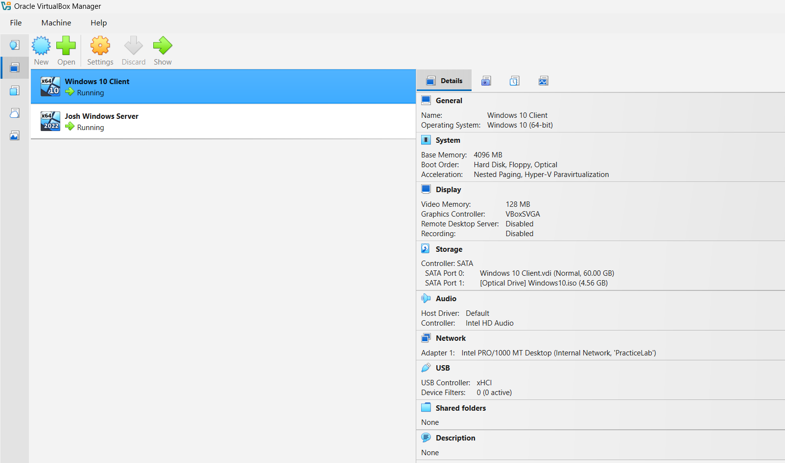
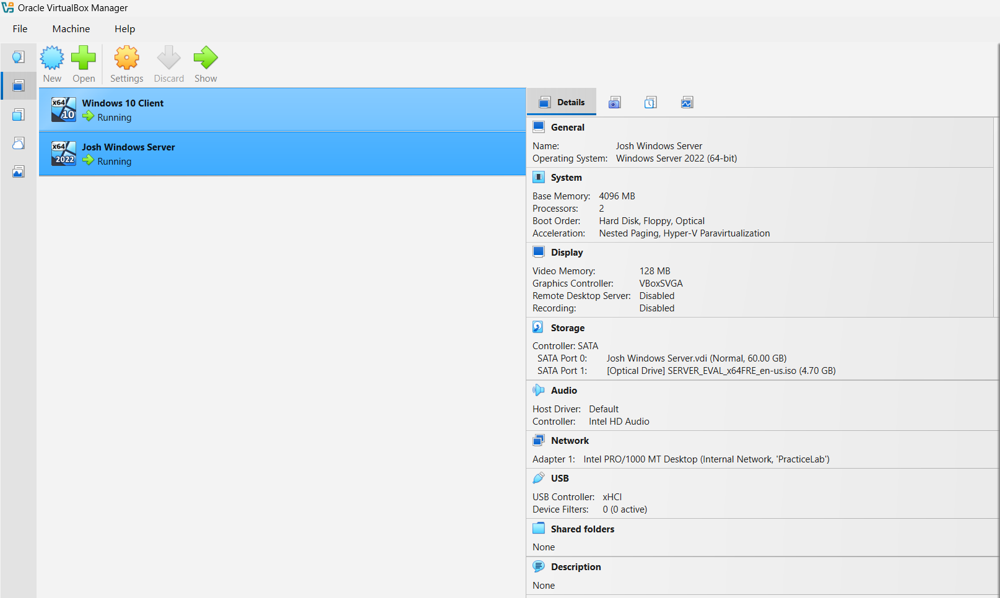
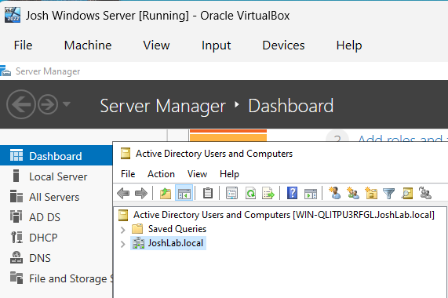
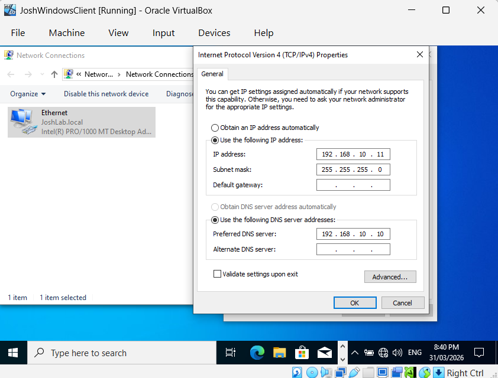
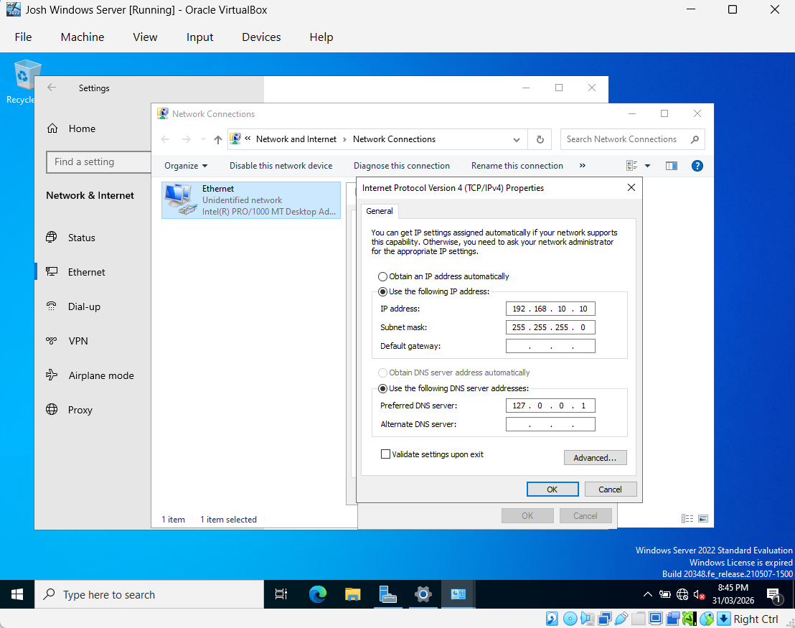
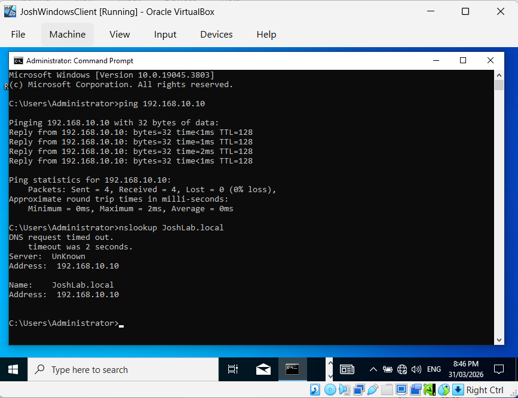
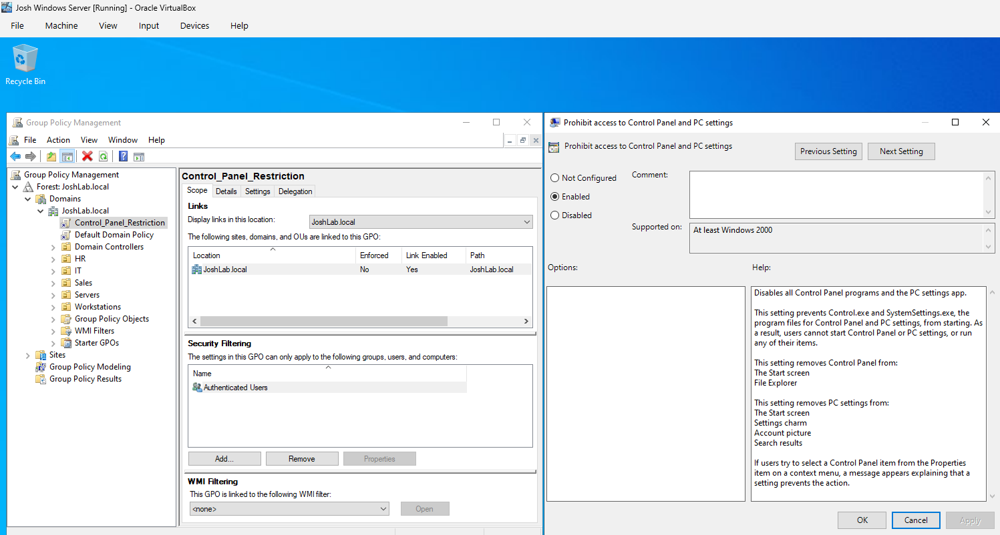

# Help Desk Lab – AD & Domain Setup

## Lab Setup: VirtualBox Client and Server
### Environment:
- Windows Server 2022 (Domain Controller)
- Windows 10 Client
- Active Directory Domain Services (AD DS)
- Virtualisation software (VirtualBox)

- Server and client VMs configured on the same internal network.

## Active Directory
- Set up an Active Directory domain (JoshLab.local)
  

- Configured static IP addressing and DNS settings on both the server and client machines to enable communication
  

- Confirmed the client machine was successfully joined to the domain via system properties

- Verified client-to-server connectivity and domain functionality using network diagnostic tools. Ping confirmed successful communication with the domain controller and nslookup validated proper DNS resolution for the domain.

## Organisational Units, Security Groups & Network Shares

- Created Organisational Units to logically organise users and resources within the domain.

- Created security groups to manage access to department-specific network shares

- Set folder permissions accordingly

- Accessed the HR department network share from the client machine

## Policies and Restrictions
- Set account lockout and password policies for domain users

- Simulated an account unlock and password reset

- Implemented a Group Policy Object which restricts user access to the Control Panel

